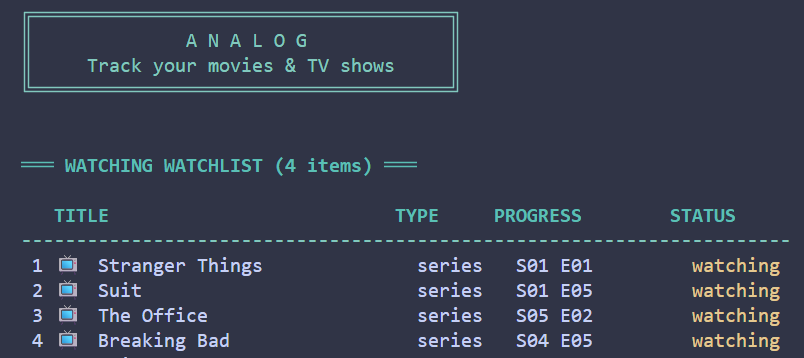

# Analog

A simple CLI tool to track your movies and TV shows. Fast, lightweight, and stores data locally.



## Features

- **Add** - Add new movies or TV series
- **List** - View all your watchlist
- **Update** - Update episode progress
- **Next** - See what episode to watch next
- **Complete** - Mark as finished
- **Drop** - Mark as dropped
- **Search** - Search by title
- **Stats** - View watching statistics
- **Rate** - Rate shows 1-10
- **Note** - Add personal notes
- **Export/Import** - Backup your data

## Installation

```bash
# Clone the repository
git clone https://github.com/yourusername/watchlog.git
cd watchlog

# Install dependencies
pip install click colorama

# Install the package
pip install -e .
